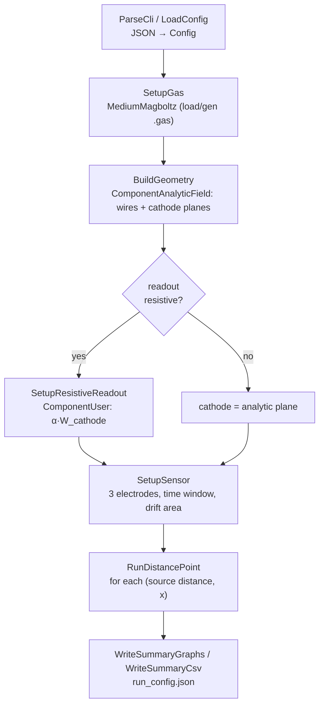
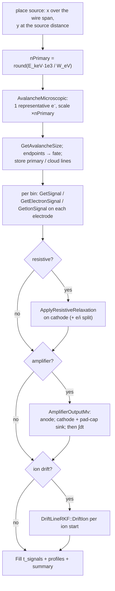

# TGC Simulation — Developer & Physics Manual

A code-anchored walkthrough of the TGC (Thin Gap Chamber) Garfield++ simulation, for graduate
detector-physics students who want to understand, run, or extend it. It assumes gas-detector basics
(ionisation, drift, Townsend multiplication, induced signals) and enough C++/Python to read the
source; it spends its length on **how this code implements the physics** and on the numerical choices
that are not obvious from the source.

The [README](../README.md) is the quick overview. This manual is the deep dive. Code is referenced by
**function / struct / section name** (e.g. `RunDistancePoint`, `BuildGeometry`) rather than line
number, so the references survive edits — open `src/tgc_sim.cc` and search.

## Table of contents

1. [Purpose & prerequisites](#1-purpose--prerequisites)
2. [The physics, in one page](#2-the-physics-in-one-page)
3. [The Garfield++ toolchain](#3-the-garfield-toolchain)
4. [Code map & pipeline](#4-code-map--pipeline)
5. [Geometry, the analytic field & weighting potentials](#5-geometry-the-analytic-field--weighting-potentials)
6. [Resistive readout](#6-resistive-readout)
7. [The avalanche & signal loop](#7-the-avalanche--signal-loop-rundistancepoint)
8. [Front-end electronics & the pad-capacitance roll-off](#8-front-end-electronics--the-pad-capacitance-roll-off)
9. [ROOT output schema](#9-root-output-schema)
10. [Configuration reference](#10-configuration-reference)
11. [The GUI](#11-the-gui)
12. [Numerical subtleties](#12-numerical-subtleties-consolidated)
13. [Building, running & extending](#13-building-running--extending)
14. [References](#14-references)

---

## 1. Purpose & prerequisites

A **TGC** (Thin Gap Chamber) is a multiwire proportional chamber run in a **quasi-saturated** mode: a
plane of thin anode wires (Ø ≈ 50 µm) at ≈ 1.8 mm pitch sits midway between two graphite-coated
cathode planes only ≈ 1.4 mm away on each side.

The defining feature is in the name: the wire-to-cathode distance is *smaller* than the wire pitch.
With a heavily quenched Ar/CO₂ mixture at ≈ 1900 V, that thin gap gives fast ns-scale signals and
good time resolution — which is why the ATLAS muon spectrometer uses TGCs for the endcap Level-1
trigger. The chamber reads out two electrodes: the **anode wires** (timing) and a segmented
**cathode pad** (position), optionally behind a **resistive** graphite layer.

The binary `tgc_sim` computes, for a given geometry, gas and bias:

- the **induced signals** on three electrodes — `anode`, `cathode` (the readout pad) and `cathode_top`
  (a Ramo cross-check) — as per-bin current waveforms and integrated charge;
- the **avalanche size** and the fate of the primary electrons;
- **conductive or resistive** cathode readout (the resistive case adds a dielectric-transparency
  factor $\alpha$ and a surface-charge relaxation tail);
- optionally a **front-end amplifier** response (CIVIDEC C2-TCT) and the **ion-drift** tail.

Everything is driven by one JSON config, shared with the PyQt5 GUI (`gui/app.py`). Units in the code
are Garfield's native **cm, V, ns, fC** unless a name says otherwise; config inputs are in µm / mm /
cm / keV and converted on load. Note **$i$ [fC/ns] ≡ $i$ [µA]**.

---

## 2. The physics, in one page

**Primary ionisation.** The code does *not* run Heed. It approximates a localised deposit by placing
$N = E/W$ electrons at the source point, $E$ = `energy_keV`, $W$ = `w_value_eV`; for the default
5.9 keV (⁵⁵Fe) in Ar/CO₂, $N = 5900/26 \approx 227$ (`nPrimary` in `RunDistancePoint`). One
*representative* electron is transported and every extensive quantity (avalanche size, induced charge,
waveform) is multiplied by $N$ — cheap and, for a point deposit, statistically exact for the mean
charge and the cathode/anode ratio.

**Drift & diffusion.** Primary electrons drift toward the nearest wire; within about a wire radius the
field goes as $1/r$ and climbs to tens of kV/cm. Transport parameters (drift velocity, diffusion,
Townsend $\alpha$, attachment $\eta$) come from a **Magboltz** table tabulated vs $|E|$ (`SetupGas`).

**Multiplication.** Close to the wire $\alpha$ dominates and the electron number grows as
$`\exp\!\big(\int \alpha\,\mathrm{d}s\big)`$; `AvalancheMicroscopic` transports collision-by-collision
and `GetAvalancheSize` returns $\langle n_e\rangle$. CO₂ is an electronegative quencher, so some
electrons **attach** ($\eta$) and a fraction of events barely multiply. The high field plus strong
quench put the chamber in the **quasi-saturated** regime characteristic of TGCs.

**Ion drift.** The CO₂⁺ ions created at the wire drift back across the 1.4 mm gap over
**microseconds**, and — because the weighting potential changes fastest near the wire — this slow
motion carries most of the induced *charge*. `DriftLineRKF` transports each ion when
`enable_ion_drift` is set (§7–8).

**Induced signal (Shockley–Ramo).** A charge $q$ moving through $\mathrm{d}\vec{r}$ induces on
electrode $i$ a current $`i_i = -q\,\vec{v}\cdot\vec{E}_{w,i}`$, equivalently a charge increment
$`\mathrm{d}Q_i = -q\,\mathrm{d}W_i`$, where $W_i$ is the **weighting potential** of electrode $i$ (1 V
on $i$, 0 V on all others, no space charge). The three TGC electrodes satisfy
$`Q_\mathrm{anode} + Q_\mathrm{cathode} + Q_\mathrm{cathode\_top} = 0`$. The anode sees a fast electron
spike then a slow ion tail; the cathode sees mostly the slow ion rise plus a small prompt spike (§5).

The observables the code produces: **avalanche size**, **fate / interaction fraction**, and the
**per-electrode induced charge and waveforms** (raw current, electron/ion split, amplifier-shaped, and
integrated).

---

## 3. The Garfield++ toolchain

The simulation is assembled from Garfield++ components. Each does one job:

| Class | Role in this code | Why it is used |
|---|---|---|
| `MediumMagboltz` | Gas medium; holds the transport/rate tables. Built in `SetupGas`. | Provides $\alpha$, $\eta$, drift, diffusion vs field, and the microscopic collision-rate table. |
| `ComponentAnalyticField` | **Closed-form** field of the wire array between the two cathode planes. Built in `BuildGeometry`. | A periodic wire-plane-between-planes geometry has an analytic field — no mesh, no boundary-element solve, no field cache (the big contrast with the sibling THGEM sim, which needs neBEM). |
| `ComponentUser` | Holds the resistive cathode's $\alpha$-scaled weighting potential. `SetupResistiveReadout`. | Lets the pad read a *scaled* copy of the analytic cathode weighting field without re-solving. |
| `Sensor` | Ties the field + the three weighting electrodes together, bins the induced signal, sets the drift medium/area. `SetupSensor`. | Central hub the avalanche/ion drifters read from and write signals to. |
| `AvalancheMicroscopic` | Microscopic electron transport (collision by collision) and the avalanche. | Realistic multiplication and per-step induced current in the strongly non-uniform near-wire field. |
| `DriftLineRKF` | Adaptive Runge–Kutta ion drift for the CO₂⁺ tail. | The ion path is bounded by the 1.4 mm gap, so RKF is safe and fast — unlike the THGEM hole geometry, where it is unbounded and that sim must use `AvalancheMC`. |
| `TrackHeed` | **Not used.** | Primaries are the $N = E/W$ point deposit of §2, not a Heed cluster model. |

Not part of Garfield: a vendored `third_party/nlohmann/json.hpp` single header for config parsing, and
ROOT for all output and the GUI canvases.

---

## 4. Code map & pipeline

`src/tgc_sim.cc` (~1800 lines, C++20). Key symbols:

| Group | Key symbols | What it does |
|---|---|---|
| Config structs | `GeometryConfig`, `ReadoutConfig`, `AmplifierConfig`, `SourceConfig`, `GasConfig`, `SimulationConfig`, `Config` | Typed mirror of the JSON schema (§10). |
| CLI / config | `ParseCli`, `LoadConfig`, `ReadDouble/Int/Bool` | `--config` / `--out` / …; JSON → `Config`. |
| Field estimate | `ComputePeakFieldVcm` | Sauli near-wire peak field (bias / gas-table margin check). |
| Gas | `SetupGas`, `ExportGasProps` | `MediumMagboltz`: load-or-generate the `.gas` table, Penning, ion mobility, collision ceiling; write `_props.csv`. |
| Geometry / field | `BuildGeometry` | `ComponentAnalyticField`: wires + the two cathode planes + the readouts. |
| Resistive readout | `ComputeResistiveParams`, `ComputePadBackplaneCapPf`, `SetupResistiveReadout` | $\alpha$ divider, relaxation $\tau$, pad↔backplane capacitance; the `ComponentUser` weighting potential. |
| Signal filters | `ApplyOnePoleHighPass`, `ApplyOnePoleLowPass`, `ApplyResistiveRelaxation`, `ApplyBoxcarAverage` | One-pole IIR building blocks. |
| Amplifier | `ComputeAmplifierParams`, `AmplifierOutputMv` | CIVIDEC C2-TCT transimpedance + the cathode pad-cap sink (§8). |
| Sensor | `SetupSensor` | Adds the 3 electrodes, time window, drift medium/area. |
| Event loop | `RunDistancePoint` | Primaries → avalanche → signals → relaxation → amplifier → ions → ROOT (§7). |
| Output | `WriteSummaryGraphs`, `WriteSummaryCsv`, `WriteJsonFile` | Summary TGraphs, `summary.csv`, `run_config.json`. |
| `main` | — | Wires the stages together (below). |

**`main()` pipeline:**



---

## 5. Geometry, the analytic field & weighting potentials

**The analytic cell.** `BuildGeometry` fills a `ComponentAnalyticField`:

- `AddPlaneY(-gap, 0, "cathode")` and `AddPlaneY(+gap, 0, "cathode_top")` — the two grounded cathode
  planes at $y = \mp$ `gap_cm`. The **bottom** plane, `cathode`, is the instrumented readout;
  `cathode_top` is the mirror plane, read out only as a Shockley–Ramo cross-check.
- `AddWire(x_w, 0, d, V, "anode")` for each of `n_wires`, at pitch `wire_pitch_cm`, diameter
  `wire_diameter_um`, potential `wire_voltage_V`. A `sense_wires` subset can restrict which wires are
  read out; by default all are.

Because the geometry is a periodic wire plane between two ground planes, `ComponentAnalyticField`
returns the drift field **and** every electrode's weighting field in closed form — there is no mesh,
no solve, and no field/weighting cache (contrast the THGEM sim's neBEM + `ComponentGrid` machinery).

**Near-wire field & bias margin.** `ComputePeakFieldVcm` implements the Sauli estimate of the field
at the wire surface (radius $r$):

```math
E_\mathrm{peak} = \frac{V}{r\,\big(\ln\!\big(\tfrac{\mathrm{pitch}}{2\pi r}\big) + \pi\,\tfrac{\mathrm{gap}}{\mathrm{pitch}}\big)}
```

The GUI mirrors it (`_compute_peak_field_kvcm`) to warn when the Magboltz table's `e_field_max_vcm`
sits below the field the wires actually reach.

**Weighting potentials.** Each readout name (`anode`, `cathode`, `cathode_top`) gets its own
Shockley–Ramo weighting field from the same analytic solve (1 V on that electrode, 0 on the others).
By the theorem the three sum to unity, so $`Q_\mathrm{anode} + Q_\mathrm{cathode} + Q_\mathrm{cathode\_top} = 0`$
for a fully collected charge — the code checks this to machine precision.

**Why the electron spike appears on the cathode.** It is tempting to expect no electron signal on the
cathode, because the cathode weighting potential is *small* near the wire (the wires screen it). But
what sets the induced charge is the *change* $\Delta W$ along the track, not $W$ itself.

Just outside the wire the avalanche electrons collapse onto it, and the two cathodes are equidistant,
so by up–down symmetry each collects $\approx$ half of the anode electron signal. That is a genuine,
sub-nanosecond spike: it carries only ≈8 % of the cathode *charge*, yet it dominates the peak
*current* precisely because it is so brief. The electrode stack and the wire geometry are drawn to
scale in panel (A) of the TikZ schematic [`docs/readout_scheme.tex`](readout_scheme.tex) (compile
with `pdflatex` for the figure).

---

## 6. Resistive readout

The default TGC here uses a **resistive cathode**: a graphite layer ($\rho_s \sim 500$ kΩ/sq) over an
insulator, with the copper readout pad behind it. `SetupResistiveReadout` applies two corrections on
top of the conductive Ramo signal, both derived in `ComputeResistiveParams`.

**1. Dielectric transparency $\alpha$.** The pad reads the analytic cathode weighting potential scaled
by a capacitive divider:

```math
W_\mathrm{pad} = \alpha\,W_\mathrm{cathode},
\qquad
\alpha = \frac{C_\mathrm{ins}}{C_\mathrm{ins} + C_\mathrm{gap} + C_\mathrm{gnd}}
```

The three arms are $`C_\mathrm{ins} = \varepsilon_r/d_\mathrm{ins}`$ (pad ↔ resistive layer),
$`C_\mathrm{gap} = 1/\mathrm{gap}`$ (pad ↔ gas return) and, if a ground plane is enabled,
$`C_\mathrm{gnd} = \varepsilon_{r2}/d_2`$ (pad ↔ backplane). For the default Kapton/FR4 stack
$\alpha \approx 0.87$. The `ComponentUser` simply returns
`alpha * fieldCmp.WeightingPotential(..., "cathode")`.

**2. Surface-potential relaxation.** Charge that lands on the resistive layer leaks to the grounded
edges with a time constant set by the sheet resistivity and the insulator:

```math
\tau = \frac{\varepsilon_0\,\varepsilon_r\,\rho_s\,L^2}{\pi^2 d},
\qquad
W(t) = W\,e^{-t/\tau}
```

Because that decay is separable, both the during-drift and the after-collection contributions reduce
**exactly** to a one-pole high-pass on the binned pad current — `ApplyResistiveRelaxation` (a thin
wrapper over `ApplyOnePoleHighPass`). It is mathematically identical to Garfield's per-step
`SetDelayedWeightingPotential` machinery for this model, but costs $`O(n_\mathrm{bins})`$ instead of
an evaluation per drift step, and is exact at the bin resolution.

For the defaults $\tau \approx 157$ µs, so the filter removes only $`\sim 10^{-5}`$ of a 1 ns spike
while still shaping the long ion tail; set `time_window_ns` $\ge 5\tau$ to capture the delayed charge.
`enable_delayed_signal` toggles it.

**Ground plane.** `ground_plane_enabled` adds the $C_\mathrm{gnd}$ arm above, lowering $\alpha$
($\approx 0.98 \to 0.87$ for 1 mm FR4) and defining the pad↔backplane capacitance the front-end sink
uses (§8).

**Validity.** $\alpha$ is the analytic dielectric-transparency approximation: it assumes the interface
field is uniform, so the gas weighting potential keeps its exact wire-screened shape and is merely
rescaled by the scalar $\alpha$. The wire ripple has decayed to ≈0.7 % a full gap below the
wires, so $`\alpha\,W`$ is accurate to **≈1 %** for the default geometry; the error grows with
$`d/\mathrm{gap}`$ and $\varepsilon_r$. Charges never enter the insulator — the gas is bounded by the
analytic cathode plane, so every electron and ion is absorbed there.
The TikZ schematic [`docs/readout_scheme.tex`](readout_scheme.tex) diagrams the implemented chain and
the remaining modelling criticalities (compile with `pdflatex` for the figure).

---

## 7. The avalanche & signal loop (`RunDistancePoint`)

Called once per (source distance, x-position); owns the per-event `TTree` `t_signals`, the summary
histograms/profiles, and the event loop.



**Representative electron.** `nPrimary = round(energy_keV·1e3 / w_value_eV)`; one electron is
avalanched and all extensive results scaled by `nPrimary`. This is exact for the mean charge and the
cathode/anode ratio, since induction is linear in charge.

**Per-bin signals.** After the avalanche the code reads `GetSignal` / `GetElectronSignal` /
`GetIonSignal` on each electrode into per-bin buffers (`bufA`, `bufC`, `bufT` and their e/i splits),
integrates them to the per-event charges (`anode_charge_fC`, `cathode_charge_fC`), then applies the
resistive relaxation (cathode) and the amplifier.

**Ions.** With `enable_ion_drift`, each ion start point (an avalanche endpoint near the wire) is
transported by `DriftLineRKF::DriftIon`, its induced signal added before the buffers are read;
`ion_max_step_um` caps the RKF step and `store_drift_lines` keeps the curved paths for the 3D view.

---

## 8. Front-end electronics & the pad-capacitance roll-off

An **opt-in** model of the **CIVIDEC C2-TCT** broadband current amplifier (`amplifier.enable`) turns
the induced current into the output voltage a scope would record; it is off by default, so a default
run's raw waveforms are byte-for-byte unchanged. `ComputeAmplifierParams` derives the parameters,
`AmplifierOutputMv` applies them per channel.

**Faithful transimpedance.** Within its band the amplifier follows the input current — there is no
differentiation:

```math
V_\mathrm{out}\,[\mathrm{mV}] = G \cdot R_\mathrm{in} \cdot \mathrm{LP}_{2\,\mathrm{GHz}}\big[\,i\,\big] \cdot 10^{-3},
\qquad
G = 10^{\,\mathrm{gain\_db}/20}
```

With the datasheet defaults $G = 100$ (40 dB) and $`R_\mathrm{in} = 50\ \Omega`$, this is simply
$`V = 5\cdot i\,[\mathrm{fC/ns}]`$. The 2 GHz upper edge is a one-pole low-pass,
$\tau \approx 0.08$ ns — negligible at 0.5 ns bins. The measured **charge** pulse is reproduced by
*integrating* the output: `anode_amp_int` / `cathode_amp_int`, $`\int V\,\mathrm{d}t`$ [mV·ns].

**The cathode pad-capacitance current sink** (frequency-dependent spike roll-off). The readout pad
has a capacitance to the grounded backplane below it, computed geometrically by
`ComputePadBackplaneCapPf` from `pad_area_cm2`, the ground-plane insulator thickness and its
$\varepsilon_r$. At the amplifier input that capacitance **sinks** high-frequency current away from
the $R_\mathrm{in}$ load, which is a one-pole low-pass (`tauLpCathodeInputNs`):

```math
C_\mathrm{pad} = \frac{\varepsilon_0\,\varepsilon_r\,A}{d},
\qquad
\tau_\mathrm{in} = R_\mathrm{in}\,C_\mathrm{pad},
\qquad
f_c = \frac{1}{2\pi R_\mathrm{in} C_\mathrm{pad}}
```

Unlike the flat gain, this attenuates the sub-ns electron **spike** far more than the µs ion tail.
That is the physically correct behaviour, and it is why a real pad readout usually does not resolve
the spike at all.

The sink is applied to the **cathode only** — `AmplifierOutputMv(..., tauLpCathodeInputNs)`, while
the anode passes `0.` — and only when resistive readout, a pad area and a ground plane are all set.
Otherwise $`C_\mathrm{pad} = 0`$, the filter is a no-op, and the run is unchanged. The values of
$C_\mathrm{pad}$, $\tau_\mathrm{in}$ and $f_c$ are printed at start-up and shown live in the GUI's
**Element impedances $`\lvert Z(f)\rvert`$** panel (§11), where $`\lvert Z_\mathrm{pad}\rvert`$
crosses $R_\mathrm{in}$ exactly at $f_c$.

**Inert legacy keys.** `coupling_cap_nf`, `wire_series_cap_pf`, `cathode_cable_cap_pf` and
`bandwidth_low_hz` are kept for JSON compatibility but apply no filter — no AC-coupling high-pass, no
cable-loading low-pass, no low-frequency edge. The wire's 470 pF is a real **detector** HV-decoupling
capacitor, not an amplifier element. `output_sample_ns` optionally boxcar-averages the output to mimic
a digitizer's finite aperture.

---

## 9. ROOT output schema

`<out>/<run>/tgc_sim.root`:

**`summary/`** — TGraphs vs source distance: `g_anode_charge`, `g_cathode_charge`,
`g_cathode_top_charge`, `g_charge_ratio`.

**`dist_<d>_x<x>/`** (one per source point) — per-electrode charge / avalanche-size histograms
(`h_anode_charge`, `h_cathode_charge`, `h_cathode_top_charge`, `h_avalanche_size`, …); `TProfile` mean
waveforms `p_anode_signal`, `p_cathode_signal`, `p_cathode_top_signal`, the electron/ion splits
`p_{anode,cathode}_{electron,ion}`, and the amplifier `p_{anode,cathode}_amp` (+ `_amp_int`); and the
per-event tree **`t_signals`**:

| Branch group | Branches | Meaning |
|---|---|---|
| Scalars | `event`, `anode_charge_fC`, `cathode_charge_fC` | per-event integrated charge |
| Waveforms | `anode`, `cathode` | induced current per bin [fC/ns], ×`nPrimary` |
| e/i split | `anode_e`,`anode_i`, `cathode_e`,`cathode_i` | electron- vs ion-induced components |
| Amplifier | `anode_amp`,`cathode_amp` (+ `_int`) | shaped output [mV] and its running integral |
| Geometry | `primary_x/y/z`, `cloud_x/y/z`, `ion_x/y/z`+`ion_npts` | drift-line points for the 3D view |

`cathode_top` appears as a summary profile / histogram (the Ramo cross-check), not a per-event tree
branch.

**Sidecars:** `summary.csv` (one row per source point — mean/rms/sem charge for the three electrodes,
charge ratio, avalanche size, interaction fraction), `run_config.json` (the exact config echo),
`<gasfile>_props.csv` (gas transport properties, for the GUI Magboltz tab), `summary/tgc_summary.png`,
and `tgc_plots.root` (a GUI plot snapshot).

---

## 10. Configuration reference

One JSON file, mirrored by the `Config` structs (§4); config units convert to Garfield units on load.
`config/default_tgc.json` ships a **resistive + amplifier** setup with `pad_area_cm2 = 25` and a
ground plane, so the §8 pad-cap sink is active by default.

**`geometry`** — `wire_pitch_cm`, `wire_diameter_um`, `gap_cm` (wire→cathode, each side), `n_wires`,
`wire_voltage_V`, `sense_wires` (list of 0-based indices, or `null` = all wires read out).

**`readout`** — `type` (`conductive` / `resistive`), `insulator_material` (`kapton` / `fr4`),
`insulator_thickness_um`, `surface_resistivity_ohm_sq`, `resistive_layer_size_cm` (square side; the
two grounded edges are this far apart, so $\tau \propto \mathrm{size}^2$), `pad_area_cm2`,
`enable_delayed_signal` (the relaxation post-filter), `ground_plane_enabled`,
`ground_plane_insulator_um`, `ground_plane_insulator_material` (`kapton` / `fr4` / `air`).

**`amplifier`** — `enable`, `gain_db`, `input_impedance_ohm`, `bandwidth_high_hz` (upper −3 dB →
low-pass $\tau$), `output_sample_ns` (boxcar aperture). **Inert** (compatibility only):
`bandwidth_low_hz`, `coupling_cap_nf`, `wire_series_cap_pf`, `cathode_cable_cap_pf`.

**`source`** — `energy_keV` (→ $N = E/W$ primaries), `source_distances_mm` (list of source heights
above/below the wire plane; `null` = random over the gap per event), `x_positions_cm` (`null` = random
over the wire span).

**`gas`** — `gas1` / `gas1_fraction_pct` / `gas2`, `ion_species` (IonMobility file base),
`temperature_K`, `pressure_Torr`, `enable_penning`, `n_magboltz_collisions`, `w_value_eV`,
`max_electron_energy_eV` (Magboltz EFINAL — keys the `.gas` filename), `n_field_points`,
`e_field_min_vcm`, `e_field_max_vcm`.

**`simulation`** — `n_events`, `max_avalanche_size` (hard cap), `time_window_ns`, `time_step_ns`
(signal bin), `enable_ion_drift`, `store_drift_lines` (needed for the curved 3D lines),
`ion_max_step_um` (0 = no cap), `random_seed` (0 = time-seeded).

---

## 11. The GUI

`gui/app.py` (PyQt5) runs the same binary and visualises its output: a **config panel** on the left, a
**results tab-set** on the right.

- **`SimRunner(QThread)`** — launches `tgc_sim` with the current config, streams stdout to the Log tab
  in real time; Stop sends `SIGTERM`.
- **`ConfigPanel(QScrollArea)`** — one `QGroupBox` per config block (Geometry, Readout, Amplifier,
  Source, Gas, Simulation, Output); Load / Save operate on the same JSON the CLI reads via `--config`.
  The Amplifier box embeds the **Element impedances $\lvert Z(f)\rvert$** group, which recomputes each
  readout element's $\lvert Z\rvert$ at two reference frequencies plus the pad-cap sink's $C_\mathrm{pad}$,
  $\tau_\mathrm{in}$, $f_c$ live — mirroring the C++ `ComputePadBackplaneCapPf` / `ComputeResistiveParams`
  (§8), so a mistuned front-end is obvious before running.
- **`ResultsPanel(QTabWidget)`** — nine result tabs (`uproot` opens the ROOT file, PyROOT draws):

| Tab | Shows |
|---|---|
| Log | live binary stdout (incl. the fate line) |
| Summary | `summary.csv` as a table, one row per (source distance, x) |
| Plots | charge / ratio / avalanche size vs distance (`summary/` graphs) |
| Waveforms | per-event `anode`/`cathode`, Raw [fC/ns] or Amplifier [mV], optional e⁻/ion overlay |
| Integrals | running charge integral of the displayed mode (fC, or mV·ns in Amplifier mode) |
| 3D Tracks | detector geometry + primary / avalanche / ion drift lines (needs `store_drift_lines`) |
| E-Field | 2D $\lvert E\rvert$ / $V$ / $E_z$ / $E_x$ maps in XY / XZ / YZ planes |
| Weighting Field | per-electrode $W$ / $\lvert E_w\rvert$ for `anode`/`cathode`/`cathode_top`; $\alpha$-scaled cathode in resistive mode |
| Magboltz | gas transport properties from the `_props.csv` sidecar |

A shared **Amplifier / Raw** selector keeps Waveforms + Integrals in sync. The Weighting-Field and
E-Field tabs are interactive straight from the geometry spinboxes — no run needed.

---

## 12. Numerical subtleties (consolidated)

The non-obvious facts, in one place (each is expanded above):

- **Resistive relaxation is an *exact* one-pole post-filter** (`ApplyResistiveRelaxation`), not an
  approximation: separability of $`W\,e^{-t/\tau}`$ makes it identical to per-step
  `SetDelayedWeightingPotential` at $`O(n_\mathrm{bins})`$ cost. §6.
- **$\alpha$ is a ≈1 % dielectric-transparency approximation** for the default geometry; the
  error grows with $`d/\mathrm{gap}`$ and $\varepsilon_r$. §6.
- **The pad-cap sink is opt-in**: it needs resistive readout **+** `pad_area_cm2 > 0` **+** a ground
  plane **+** the amplifier; otherwise $C_\mathrm{pad} = 0$ and the run is byte-for-byte unchanged. §8.
- **Ion drift needs `GARFIELD_INSTALL`** so the CO₂⁺ mobility table (`IonMobility_CO2+_CO2.txt`) loads;
  the binary otherwise **fails fast** with a clear message rather than running without ions. §13.
- **Two RNGs must be seeded.** ROOT's `gRandom` drives source-point sampling (`gRandom->Uniform`),
  while Garfield's avalanche/drift use their **own** engine (`TRandom3` inside `RandomEngineRoot`), not
  `gRandom`; both are seeded from `random_seed` (0 → per-run UUID). Seeding only `gRandom` does *not*
  make an avalanche reproducible.
- **The point-deposit spike is artificially narrow** (~0.2 ns vs ~3 ns in reality); when matching
  scope traces compare to `*_amp` (or the GUI Amplifier mode), not the raw current.
- **The 470 pF wire cap is a detector component**, not an amplifier filter — it and the other legacy
  amplifier keys are inert. §8.
- **Gas tables are cached by name.** `SetupGas` regenerates the Magboltz table only when the derived
  `.gas` filename changes (any gas / field-grid parameter); deleting the file forces a rebuild. §13.
- **Re-plotting a ROOT canvas after closing its window** used to crash on macOS; fixed (commit
  `871403e`) by recreating the canvas instead of reusing a dead one.

---

## 13. Building, running & extending

**Build** (ROOT's `FindVdt` needs help; paths passed explicitly):

```bash
cmake -S . -B build -DCMAKE_BUILD_TYPE=Release \
  -DVDT_INCLUDE_DIR=<conda-root>/include \
  -DVDT_LIBRARY=<conda-root>/lib/libvdt.dylib \
  -DCMAKE_PREFIX_PATH="$(pwd)/../../local/garfield;<conda-root>"
cmake --build build -j4
```

**Run** (ion mobility found via the environment):

```bash
export GARFIELD_INSTALL=/path/to/Garfield++/local/garfield
./build/tgc_sim --config config/default_tgc.json --out results
python3 gui/app.py            # or drive the binary from the GUI
```

CLI flags: `--config <path>`, `--out <dir>`, `--run-name <name>`, `--distance <mm>` (override the
config's distance list), `--help`. `ctest --test-dir build` runs the smoke config. The first run
generates the Magboltz `.gas` table (~5–15 min) into the project directory; later runs load it
instantly.

**Extending:**

- *Add a config knob* — add the field (with a default) to the relevant `…Config` struct, read it in
  `LoadConfig` via `ReadDouble/Int/Bool`, echo it in the `run_config.json` writer, and add a GUI widget
  + a `load_from_dict` line.
- *Instrument another electrode* — add its plane/wire with a `"name"` in `BuildGeometry`,
  `AddElectrode` it in `SetupSensor`, and add the branch set (`<id>`, `<id>_e/_i`, `<id>_amp/_amp_int`)
  plus a `TProfile`.
- *Change the gas* — edit the `gas` block; a new mixture / field grid generates a fresh Magboltz table
  (slow, one-time) keyed by the `.gas` filename.
- *Add an amplifier stage* — extend `AmplifierParams` / `ComputeAmplifierParams` and apply it in
  `AmplifierOutputMv` (reuse `ApplyOnePoleLowPass` / `ApplyOnePoleHighPass`); mirror the derived numbers
  in the GUI `|Z(f)|` panel so the config stays self-documenting.

---

## 14. References

- **Garfield++** — H. Schindler & R. Veenhof, simulation of particle detectors,
  <https://garfieldpp.web.cern.ch/>. Classes used here: `MediumMagboltz`, `ComponentAnalyticField`,
  `ComponentUser`, `AvalancheMicroscopic`, `DriftLineRKF`, `Sensor`.
- **Magboltz** — S. Biagi, electron transport in gas mixtures (the `.gas` tables).
- **`ComponentAnalyticField`** — analytic multiwire chamber fields (the wire-plane-between-cathodes
  geometry solved in closed form).
- **Gas detectors** — F. Sauli, *Principles of Operation of Multiwire Proportional and Drift Chambers*,
  CERN 77-09 (1977), and *Gaseous Radiation Detectors* (Cambridge Univ. Press, 2014) — proportional
  multiplication and the near-wire field.
- **TGC / ATLAS** — S. Majewski, G. Charpak, A. Breskin, G. Mikenberg, *A thin multiwire chamber
  operating in the high multiplication mode*, NIM 217 (1983) 265; ATLAS Muon Spectrometer TDR,
  CERN/LHCC 97-22 — the endcap-trigger TGCs.
- **Shockley–Ramo** — W. Shockley, J. Appl. Phys. 9 (1938) 635; S. Ramo, Proc. IRE 27 (1939) 584 — the
  induced-signal theorem this code integrates via the weighting potential.
- **Resistive readout** — reviews of resistive-electrode MPGDs (e.g. M. Dixit et al. on resistive
  charge spreading) for the $\alpha$ / relaxation picture used in §6.
- **CIVIDEC C2-TCT** — broadband transimpedance current amplifier (the front-end model in
  `AmplifierOutputMv`).
